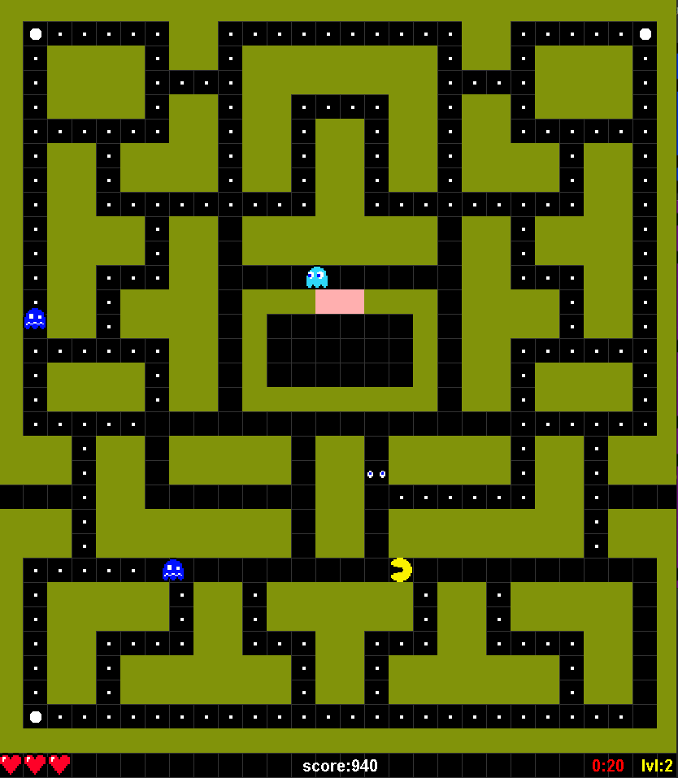

# pacman-m1-gl
Projet de Pac-Man dans le cadre de l'UE génie logiciel en m1 informatique.
Ceci est une copie de jeu Pac-Man. elle contient tous les fonctionalité du jeu original
(les niveau, comportement des fantomes, system de score , etc...)
## conditions d'éxecution
Le jeu est exécutable sur tous les systèmes d’exploitation les plus connue (Windows, Mac, Linux).
Java 16.00 ou une version plus récente est nécessaire sur la machine pour lancer le jeu. La taille du jeu est fixe à (840 *990)

## le jeu 
Ce jeu est Pac-Man. C’est un jeu d’arcade légendaire des années 80. Il s’agit d’un jeu en 2D du type action et labyrinthe. Vous contrôlez un petit personnage du nom de PAC-MAN. Votre rôle est de manger des PAC-gommes qui sont répartis dans un labyrinthe. Ce labyrinthe est d’ailleurs gardé par quatre fantômes qui vous pourchasseront durant votre quête. 

## Captures d'écran

 

## tester le jeu
Vous pouvez tester le jeu:
1. avec la commande `./grdlew run` en se mettant sur le dossier pacman `cd pacman`
2. avec le menu gradle sur tasks> application > run.
3. avec le fichier jar pacman-0.9.jar (situé en même niveau que REDME.md). Note (les sons ne sont pas disponible dans le jar à cause d'un bug)

### Librairies utilisées
Les libraires utilisées dans le projet sont SWING et JUNIT (gradle)

## les contrôles 
- Vous utilisez les flèches du clavier pour déplacer PAC-MAN.
- la touche M pour passer au niveau suivant.
sur l'écran de défaite:
- la touche Enter pour retourner au menu.
- la touche Space pour rejouer. 
## organisation des fichiers
L’ensemble des fichiers de ce projet sont séparés en 3 répertoires :
### Engines 
Il contient les classes engines utilisé par le jeu, les Engines sont modulaires.
### Game 
Il contient les classes qui définissent la logique du jeu de Pac-Man.
### Utility 
C'est un répertoire avec des classes d'usage général, elles sont utilisées dans les deux répertoire Game et Engines.

## Credit:
- EL AFYA Anass
- SANCHEZ Hugo
- MASSAT Cédric
- POLO Charlène
- VOLT Dorian
- Encadré par : HAMRI Maamar el amine

